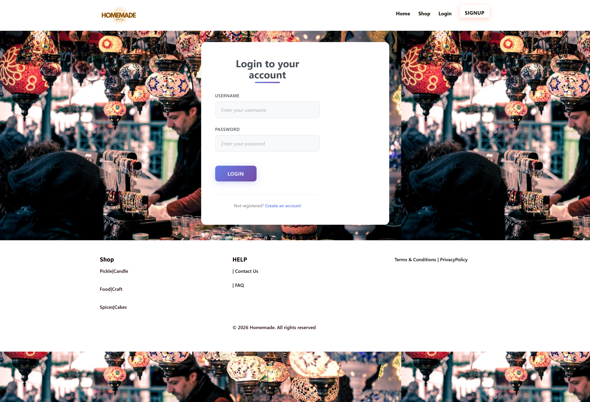
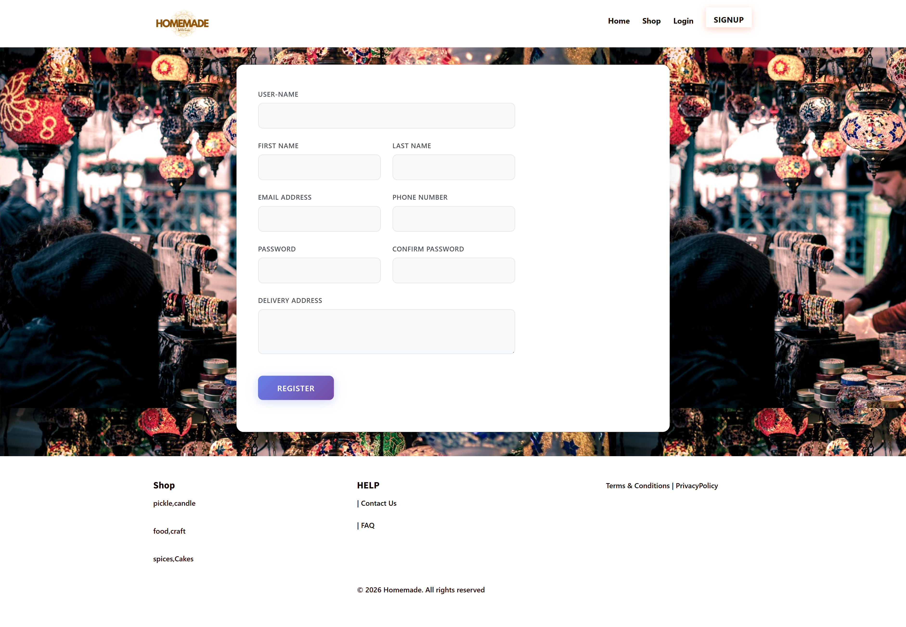
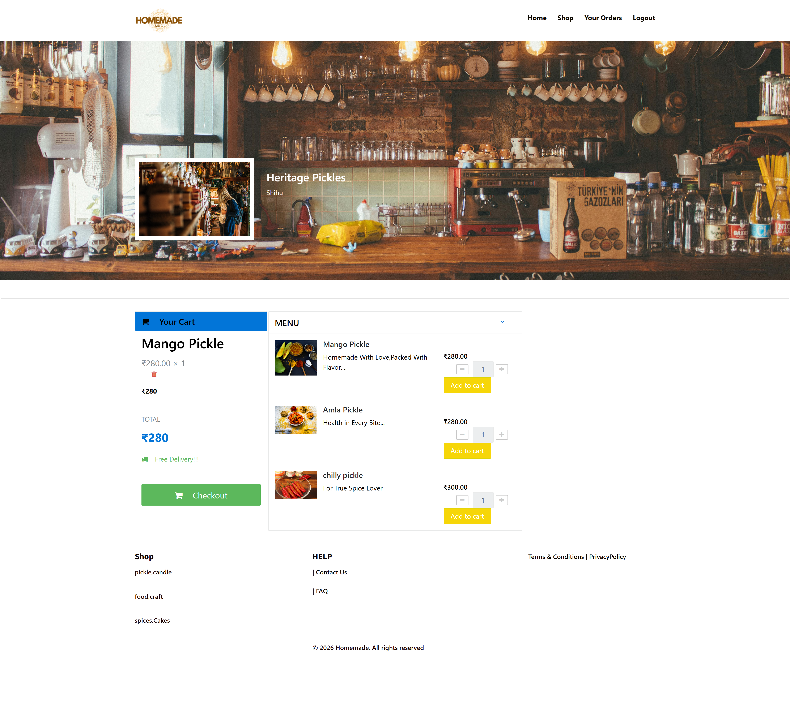

# LOCAL CART FOR HOMEMADE GOODS

## About the Project

This project is about ordering Homemade Prouducts online from your favourite Shops. Anybody can create an account and order online.

## Screenshots

    <b>Main Page</b>

    <b>Login Page</b>

    <b>Register Page</b>

    <b>Dishes Page</b>

    <b>Admin Main page</b>

    <b>Admin Home Page</b>

## Installation

In XAMPP, just create new database in phpmyadmin and import SQL file which is located in `SQL/` directory.

## Admin Page

To access admin portal, type this in URL `root/admin/ ` where root is your root directory

Admin credentials: Username: admin Password: admin123

## Technologies Used

1. PHP
2. SQL
3. BOOTSTRAP 4
4. AJAX
5. JQUERY

## System Requirements

Software : XAMPP 

## Demo

Try the application: https://restaurantshub.000webhostapp.com/
